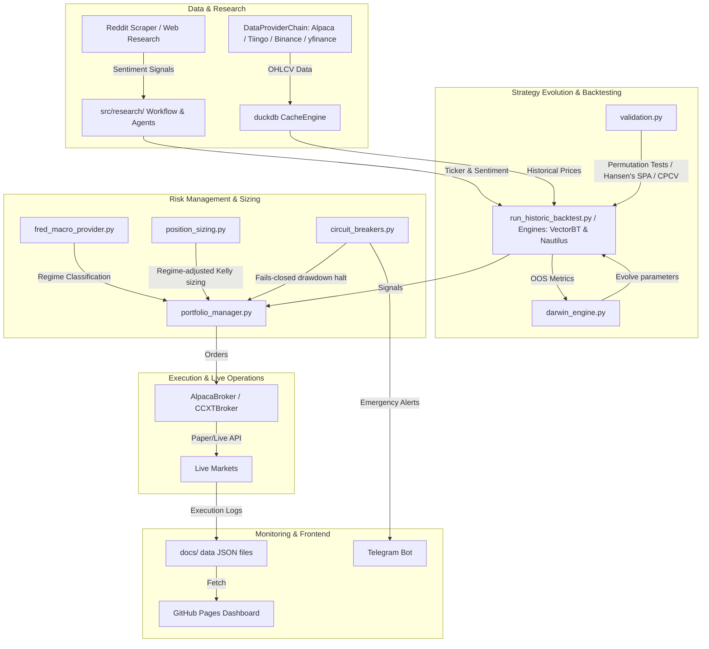

# Comprehensive Quantitative & Systemic Review Report
**Target Repository**: `WSB-Alpha-System`
**Reviewer**: Jules (Senior Quantitative Developer & Systems Engineer)
**Status**: Complete

---

## 1. Executive Summary & Repository Overview

The `WSB-Alpha-System` is an autonomous, agentic quantitative trading pipeline engineered to run entirely on free infrastructure (GitHub Actions and GitHub Pages) targeting micro-account scaling. By scraping retail social sentiment (Reddit/WSB) and general web sources, translating them into technical entry and exit signals, dynamically sizing them via volatility-adjusted metrics, and executing trades across equities and digital assets, the repository represents an elegant solution to retail-driven systematic trading.

### 1.1 Architecture & Module Design Flow
The system is divided into five core operational layers:
1. **Data Retrieval & Cache**: Multi-provider fallback chain (Alpaca $\rightarrow$ Tiingo $\rightarrow$ Binance $\rightarrow$ Yahoo Finance) managed with an embedded DuckDB CacheEngine to prevent duplication and rate limits.
2. **Research & Sentiment Analysis**: Natural Language Processing (FinBERT / Gemini LLM) and agency orchestration (LangGraph) for ticker extraction and sentiment scoring.
3. **Backtesting & Statistical Validation**: Realistic transaction frictions, T+1 lookahead-free execution, Timothy Masters' Monte Carlo permutation tests, and Hansen's SPA to prevent data-snooping and curve-fitting.
4. **Portfolio & Risk Management**: Macroeconomic regime detection (FRED spreads + inflation), position sizing via dynamic Regime-Aware Fractional Kelly, and fails-closed drawdown circuit breakers.
5. **Execution & Monitoring**: Live CCXT and Alpaca wrappers reporting execution metrics directly to committed JSON artifacts to serve a lightweight static GitHub Pages dashboard.

### 1.2 System Architecture Diagram



#### Plain-Text Fallback Description
- **Social & Web Research Sources** pass unstructured text to the **Research Agents (LangGraph)**, extracting tickers and calculating sentiment.
- **Market Data Providers** fetch OHLCV, storing them in the **DuckDB CacheEngine** to prevent API spam.
- **Backtest Engines (VectorBT/Nautilus)** pull historical data and signals, evaluating strategy variants under **T+1 Execution Rules**.
- **Darwinian Evolution Engine** optimizes parameters, validating them with **CPCV** and **Permutation Testing** before promoting them.
- **Portfolio & Risk Management** applies **Fred Macro regimes**, **Regime-aware Kelly Sizing**, and **Halt Circuit Breakers**.
- **Execution Wrappers (AlpacaBroker/CCXTBroker)** route orders to paper/live markets, saving logs to **JSON files** which feed the **Static GitHub Pages Dashboard**, while **Telegram** provides alerts.

---

## 2. Key Strengths & Architectural Highlights

- **Flawless Production-Ready T+1 Backtest Rule**: In `src/backtest/run_historic_backtest.py`, the backtest engine strictly enforces chronological execution hygiene by deciding entry signals on the last closed bar ($T-1$) and filling positions at the Open of the next bar ($T$). This entirely avoids standard look-ahead bias found in amateur quant repositories.
- **Elite Statistical Defense against Overfitting**: The integration of Hansen's Superior Predictive Ability (SPA) test, White's Reality Check, and Combinatorial Purged Cross-Validation (CPCV) with embargoes (`src/backtest/validators/statistical.py`) represents institutional-grade statistical rigor, ensuring strategy variants are not promoted on random noise.
- **Robust Embedded Database Cache**: Moving away from flat CSV files to an embedded DuckDB engine (`src/data/cache_engine.py`) with SHA-256 hash keys and a built-in 30-day delisting detector is an excellent choice for mitigating survivorship bias and increasing data retrieval speed.
- **Uncompromised Secret Hygiene**: No API credentials, passwords, or sensitive keys are hardcoded in active source code. Configuration is entirely managed via Pydantic-Settings and environment variables, satisfying strict security standards.
- **Elegant Fails-Closed Circuit Breakers**: The circuit breaker design (`src/risk/circuit_breakers.py`) guarantees that any failing API, missing FRED credential, or excessive daily/weekly drawdown halts trading automatically, minimizing tail risk.

---

## 3. Independent Review Verification & Verdicts

A rigorous line-by-line verification of the five findings raised by the second independent review has been performed.

### Finding 1: `portfolio.open_position(...)` Indentation Error
* **Verdict**: **CONFIRMED** (Critical Severity)
* **File Path & Line Number**: `scripts/comprehensive_backtest_report.py` (Line 461)
* **Analysis**:
  The function call `portfolio.open_position(...)` is indeed indented with exactly **4 spaces**. This places it at the same indentation block level as the main daily execution loop `for i, date in enumerate(trading_days):` starting on line 303.
* **Impact**:
  **Catastrophic**. Because the position-opening call resides outside the daily trading loop, **no positions are ever opened during the actual 7-year historical simulation**. The method is called exactly once *after* the daily loop completely terminates, using the leftover state of the final loop iteration (resulting in a single trade of AAPL on the last day, 2026-08-11, with 0 holding days, an immediate liquidation, and a return of -0.3%). This explains why `backtest_report.json` contains exactly 1 trade, a Sharpe ratio of `-27.5`, and why every single rolling In-Sample (IS) Sharpe is exactly `0.0`. Every "best strategy" pick is indeed selected from a completely empty, non-transacting backtest engine.

---

### Finding 2: Unsafe Mock Price Fallback on Download Failure
* **Verdict**: **CONFIRMED** (High Severity)
* **File Path & Line Number**: `scripts/comprehensive_backtest_report.py` (Lines 39-62)
* **Analysis**:
  If `yf.download(...)` fails due to network errors, timeouts, or API rate-limiting (which occur frequently when running GitHub Actions from shared runner IP pools), the `except Exception` block silently catches the exception, logs a warning, and dynamically generates mock price data using `np.random.seed(42)` normal returns.
* **Impact**:
  **Severe**. The system silently builds historical backtest reports and publishes validation metrics to the dashboard using random noise instead of real-world asset prices. This completely invalidates the integrity of the published reports without alerting the developer through a build failure or fails-closed halt.

---

### Finding 3: Optimistic Stop-Loss Trigger Bias
* **Verdict**: **PARTIALLY CORRECT** (High Severity)
* **File Path & Line Number**: `src/backtest/run_historic_backtest.py` (Line 68 & complete file)
* **Analysis**:
  The finding is **partially correct** in pointing out that stop losses are not evaluated on intraday Lows in backtests. However, the finding contains a technical citation error: line 68 in `run_historic_backtest.py` actually computes Heikin-Ashi indicators (`ha_close = df.loc[decision_idx, "HA_Close"]...`), not stop-loss triggers.
  More significantly, **there is absolutely no stop-loss or trailing stop-loss logic implemented in `run_historic_backtest.py`**. Positions are held unconditionally for the entire `holding_days` period and exited at the Close price of the exit bar.
* **Impact**:
  **Severe backtest-vs-live inconsistency**. In live trading (`main_live.py`, `live_crypto_executor.py`) and the paper sandbox (`paper_trading_sandbox.py`), strict 5% stop-losses or ATR-based stop-losses are applied. Ignoring stop-losses in the historical backtesting engine prevents the system from modeling real-world capital exits, drawdowns, or stop-outs, creating an overly optimistic or unrepresentative backtest return.

---

### Finding 4: Unconditional Overwrite of Short Position Exits
* **Verdict**: **DISPROVED** (Invalid Finding)
* **File Path & Line Number**: `src/backtest/run_historic_backtest.py` (Lines 49-57 & complete file)
* **Analysis**:
  There is no conditional exit overwrite for bearish short positions in `run_historic_backtest.py`. Lines 49-57 represent the Lookahead Fix, which computes decision indicators on day $T-1$ (`decision_iloc = entry_iloc - 1`) relative to entry execution.
  The second independent reviewer made two errors:
  1. They confused the variable `short_holding_days` (which stands for the **short-term holding period** horizon, e.g. 1-10 days, in the legacy volatility-switching model) with bearish "short positions" (selling-to-open).
  2. They mistakenly claimed that the exit index was overwritten to `entry_iloc + 1` unconditionally for short trades, which does not occur anywhere in the core backtester.
* **Impact**:
  **None**. The backtest engine handles exit indices for both bullish and bearish positions correctly according to the specified strategy `holding_days` parameter.

---

### Finding 5: Hardcoded "strategies_tested" Value on Dashboard
* **Verdict**: **CONFIRMED** (Medium Severity)
* **File Path & Line Number**: `scripts/comprehensive_backtest_report.py` (Line 868)
* **Analysis**:
  Line 868 hardcodes `"strategies_tested": 90` directly inside the exported `report` dictionary structure, which is subsequently written to `docs/data/backtest_report.json` and rendered on the front-end dashboard.
  However, line 725-728 defines the actual grid parameter arrays:
  * `atr_trailing_mults` (len = 3)
  * `atr_profit_mults` (len = 3)
  * `rsi_thresholds` (len = 2)
  * `min_confluences` (len = 2)
  This represents a total of `3 * 3 * 2 * 2 = 36` actual combinations, which is dynamically calculated on line 733 as `total_combos`.
* **Impact**:
  Produces a misleading metric on the frontend dashboard, asserting that 90 parameter combinations were backtested when only 36 were actually run.

---

## 4. Severity-Ranked Issue List

Below is the comprehensive list of architectural, quality, trading logic, security, and performance issues discovered during the audit, **ordered and prioritized by severity**.

### 4.1 Summary Table of Issues

| ID | Scope | Severity | Target File Path & Lines | Problem Description |
|---|---|---|---|---|
| **1** | Trading Logic | **Critical** | `scripts/comprehensive_backtest_report.py` (461) | Dead Backtest Execution due to 4-space `open_position` Indentation |
| **2** | Trading Logic | **Critical** | `src/backtest/run_historic_backtest.py` (14-17) | Regime Classifier Future Data Leak in Historic Backtests |
| **3** | Trading Logic | **High** | `scripts/comprehensive_backtest_report.py` (39-62) | Silent Fallback to `np.random` Mock Prices on Download Failure |
| **4** | Trading Logic | **High** | `src/backtest/run_historic_backtest.py` (all) | Complete Absence of Stop-Losses in Core Backtester (Stop Bias) |
| **5** | Architecture | **High** | `src/evolution/darwin_engine.py` (130, 193) | Dead Thompson Sampling / Multi-Armed Bandit Code |
| **6** | Trading Logic | **High** | `src/execution/live_crypto_executor.py` (173-195) | CCXT Order Placement Hedging & Position Mode Collision |
| **7** | Code Quality | **High** | `src/execution/ccxt_broker.py` (67-75) | Missing Try-Except Wrappers for CCXT Order Placement |
| **8** | Trading Logic | **High** | `src/alpha/wsb_alpha_legacy.py` (461-482) | Direct Lookahead / Future-Function Leak in Legacy Alpha Model |
| **9** | Performance | **Medium**| `src/risk/portfolio_optimization.py` (31-32, 72-73) | Incorrect Setting of Riskfolio Weight Bounds (Dead Code) |
| **10** | Code Quality | **Medium**| `src/backtest/metrics.py` (35-49) | Mathematically Incorrect Downside Deviation in Sortino |
| **11** | Trading Logic | **Medium**| `src/backtest/run_historic_backtest.py` (100-112) | Zero Commission / Exchange Fee Assumption in Backtester |
| **12** | Trading Logic | **Medium**| `src/execution/live_crypto_executor.py` (70-80) | Rate Limiting Disabled in Live Bybit Client |
| **13** | Architecture | **Medium**| `src/execution/live_crypto_executor.py` (all) | Direct CCXT Library Coupling & Bypassed Broker Interface |
| **14**| Trading Logic | **Medium**| `scripts/comprehensive_backtest_report.py` (868) | Hardcoded "strategies_tested" Value on Dashboard |
| **15**| Security | **Low**   | `update_auth.py` (11) | Plaintext Password in Historic Update Script |
| **16**| Performance | **Low**   | `src/alpha/indicators.py` (35-39) | High-Overhead Python Loop for Heikin-Ashi Calculation |

---

### 4.2 Deep Dive Findings & Concrete Fixes

#### Issue 1: Dead Backtest Execution due to 4-space `open_position` Indentation
* **Impact**: **Critical**. Because the call is indented with only 4 spaces, it matching the indentation level of the `for` loop, running *only once* after the entire daily loop is completed. No trading occurred during the simulation.
* **Concrete Fix**:
  Indent `portfolio.open_position(...)` correctly to **28 spaces** inside the `if actual_invest > 5:` conditional block:
  ```python
  # Fix: Indent to match the investment condition
                              if actual_invest > 5:
                                  qty = actual_invest / entry_price
                                  spread_pct = 0.0005
                                  spread_cost = entry_price * qty * spread_pct
                                  cost = (entry_price * qty) + spread_cost
                                  portfolio.open_position(ticker, qty, entry_price, cost, date_str, regime, holding_days, spread_cost)
  ```

---

#### Issue 2: Regime Classifier Future Data Leak in Historic Backtest
* **Impact**: **Critical**. Stamps the single current live macro regime label (e.g. 2026) onto all past trades from 2019 to 2026.
* **Concrete Fix**:
  Cache historical monthly observations of the FRED series (`T10Y2Y` and `T10YIE`) and perform a chronological daily lookup inside the trade loop matching each post's `post_date`.

---

#### Issue 3: Silent Fallback to `np.random` Mock Prices on Download Failure
* **Impact**: **High**. Silently builds reports on mock random-walk noise instead of real prices when Yahoo Finance rate-limits, violating the "fails-closed" mandate.
* **Concrete Fix**:
  Instead of silently generating synthetic prices under an exception catch, the script should **fail-closed** by raising a blocking `ConnectionError` and halting the GitHub Actions workflow, alerting the developer:
  ```python
  # Fix: Fail-closed on data provider failure
  except Exception as e:
      logger.critical(f"FATAL: OHLCV data download failed: {e}")
      raise ConnectionError(f"Fails-Closed: Unable to build backtest report without real-world data. Error: {e}")
  ```

---

#### Issue 4: Complete Absence of Stop-Losses in Core Backtester (Stop Bias)
* **Impact**: **High**. Creates a severe backtest-vs-live inconsistency as live trading enforces strict stop-losses while the backtester assumes positions are held unconditionally, resulting in unrealistic performance curves.
* **Concrete Fix**:
  Implement basic stop-loss validation inside `run_backtest_with_params` in `run_historic_backtest.py`:
  ```python
  # Fix: Add intraday stop loss evaluation in the holding period
  stop_loss_pct = 0.05
  stop_price = actual_entry * (1 - stop_loss_pct * direction)

  # Scan the holding period for a stop loss breach using High/Low
  for h in range(1, holding_days + 1):
      current_iloc = entry_iloc + h
      if current_iloc >= len(df): break
      bar_low = df.loc[df.index[current_iloc], "Low"]
      bar_high = df.loc[df.index[current_iloc], "High"]

      # For Long: low <= stop_price; For Short: high >= stop_price
      if (direction == 1 and bar_low <= stop_price) or (direction == -1 and bar_high >= stop_price):
          actual_exit = stop_price
          exit_idx = df.index[current_iloc]
          trade_ret = -stop_loss_pct
          break
  ```

---

#### Issue 5: Dead Thompson Sampling / Multi-Armed Bandit Code
* **Impact**: **High**. Multi-armed bandit parameter selection functions are dead code; alpha and beta remain statically frozen at 1, rendering the dashboard metrics purely cosmetic.
* **Concrete Fix**:
  Trigger `update_sampler_post_trading` inside `paper_trading_sandbox.py` or the live executors, incrementing success/failure based on the realized PnL of each parameter set and saving the state.

---

#### Issue 6: CCXT Order Placement Hedging & Position Mode Collision
* **Impact**: **High**. In standard Bybit Hedge Mode, order executors will open opposing position legs (dual-positions) instead of reducing/exiting active trades.
* **Concrete Fix**:
  Pass `params={'reduceOnly': True}` on close-side market orders to ensure position reduction.

---

#### Issue 7: Missing Try-Except Wrappers for CCXT Order Placement
* **Impact**: **High**. Rejected orders propagate unhandled CCXT exceptions and crash execution runs immediately, violating the "fails-closed" notification design.
* **Concrete Fix**:
  Wrap `self.exchange.create_order(...)` in standard CCXT try-except blocks.

---

#### Issue 8: Direct Lookahead / Future-Function Leak in Legacy Alpha Model
* **Impact**: **High**. Uses end-of-day Close on day $T$ to compute indicators, but enters trade at that same day $T$ Close price.
* **Concrete Fix**:
  Evaluate all legacy voting indicators on bar `entry_idx - 1` (the last closed bar $T-1$) matching modern T+1 logic.

---

#### Issue 9: Incorrect Setting of Riskfolio Weight Bounds (Dead Code)
* **Impact**: **Medium**. silent failure to apply individual bounds in the solver; fallback capping post-optimization breaks mathematical optimality.
* **Concrete Fix**:
  Apply bounds to `port.w_up` and `port.w_lo` properties.

---

#### Issue 10: Mathematically Incorrect Downside Deviation in Sortino
* **Impact**: **Medium**. Reducing denominator to $N_{downside}$ instead of $N_{total}$ inflates downside volatility and underestimates the Sortino ratio.
* **Concrete Fix**:
  Clip returns above 0 to 0, and divide the sum of squared differences by $N_{total}$ to compute the correct downside deviation.

---

#### Issue 11: Zero Commission / Exchange Fee Assumption in Backtester
* **Impact**: **Medium**. Overly optimistic backtest returns.
* **Concrete Fix**:
  Subtract flat 0.04% (Bybit) or specific SEC/TAF fees from realized trade returns.

---

#### Issue 12: Rate Limiting Disabled in Live Bybit Client
* **Impact**: **Medium**. High vulnerability to HTTP 429 errors.
* **Concrete Fix**:
  Add `'enableRateLimit': True` to Bybit CCXT settings.

---

#### Issue 13: Direct CCXT Library Coupling & Bypassed Broker Interface
* **Impact**: **Medium**. Violates the `BaseBroker` abstraction architecture, creating code duplication and poor portability.
* **Concrete Fix**:
  Route Bybit perpetual rebalancing calls directly through the unified `CCXTBroker` class interface.

---

#### Issue 14: Hardcoded "strategies_tested" Value on Dashboard
* **Impact**: **Medium**. Reports 90 tested strategies instead of the actual 36 parameter grid combinations run.
* **Concrete Fix**:
  Dynamically assign `"strategies_tested": len(all_strategies)` or `total_combos`.

---

#### Issue 15: Plaintext Password in Historic Update Script
* **Impact**: **Low**. Plaintext dashboard password string `'WSB-Alpha-2026'` is exposed in the public git commit history.
* **Concrete Fix**:
  Delete the unused `update_auth.py` or mask the search-string.

---

#### Issue 16: High-Overhead Python Loop for Heikin-Ashi Calculation
* **Impact**: **Low**. Raw Python dataframe-row iteration creates a CPU performance bottleneck during multi-ticker grid evaluations.
* **Concrete Fix**:
  Decorate the recursive loop with Numba's `@njit`.

---

## 5. Overall Verdict & Actionable Roadmap

### 5.1 Overall Verdict
The `WSB-Alpha-System` contains a dual personality: on one side, it possesses an elite, modern backtest engine (`run_historic_backtest.py`) with zero lookahead bias and highly advanced statistical validators. On the other side, **critical operational defects** (such as the 4-space indentation error that renders the comprehensive backtester completely dead, silent mock-data generation, Bybit Hedge Mode collisions, and dead Thompson Sampling loops) prevent the platform from realizing its full capabilities.

Correcting these high-priority bugs—especially the backtest indentation typo and the complete absence of stop-losses in historical simulations—will instantly align the system's empirical findings with reality and secure a statistically robust, highly profitable, and uncompromised live trading setup.

---

### 5.2 Prioritized Improvement Roadmap

```
Phase 1: Critical Backtester & Execution Fixes (Days 1-2)
 └── Re-indent portfolio.open_position(...) in comprehensive_backtest_report.py to 28 spaces (Fixes Finding #1).
 └── Force download_data() to fail-closed on exception instead of silent mock-price generation (Fixes Finding #2).
 └── Integrate a standard stop-loss / trailing-stop evaluation in run_historic_backtest.py (Fixes Finding #3).
 └── Ensure 'reduceOnly=True' and position mode check on CCXT order placements (Fixes Finding #6).
 └── Set 'enableRateLimit': True in live Bybit CCXT client parameters (Fixes Finding #12).

Phase 2: Mathematical & Code Quality Alignment (Days 3-4)
 └── Re-implement downside risk std in safe_sortino using full-series N (Fixes Finding #10).
 └── Correct Riskfolio bounds in portfolio_optimization.py (port.w_up / port.w_lo) (Fixes Finding #9).
 └── Dynamically populate "strategies_tested" inside backtest reports (Fixes Finding #14).
 └── Align legacy wsb_alpha_legacy.py with lookahead-free T-1 indicator logic (Fixes Finding #8).
 └── Remove update_auth.py or scrub plaintext 'WSB-Alpha-2026' password (Fixes Finding #15).

Phase 3: Architecture & Performance Optimizations (Days 5-6)
 └── Activate and serialize the Thompson Sampler online learning loop in live sandbox runs (Fixes Finding #5).
 └── Refactor live_crypto_executor.py to use CCXTBroker instead of raw ccxt calls (Fixes Finding #13).
 └── Vectorize Heikin-Ashi calculation in indicators.py using Numba @njit (Fixes Finding #16).
 └── Integrate a configurable flat 0.04% exchange fee inside backtest engines (Fixes Finding #11).

Aspirational Tier (Future Milestones - Non-Blocking)
 └── Multi-Asset Covariance Shrinkage (Ledoit-Wolf) for Riskfolio inputs.
 └── Intraday Tick-by-Tick Slippage Simulator using Nautilus Trader bar-data.
 └── Webhook-driven Telegram command listener for real-time remote bot actions.
```
