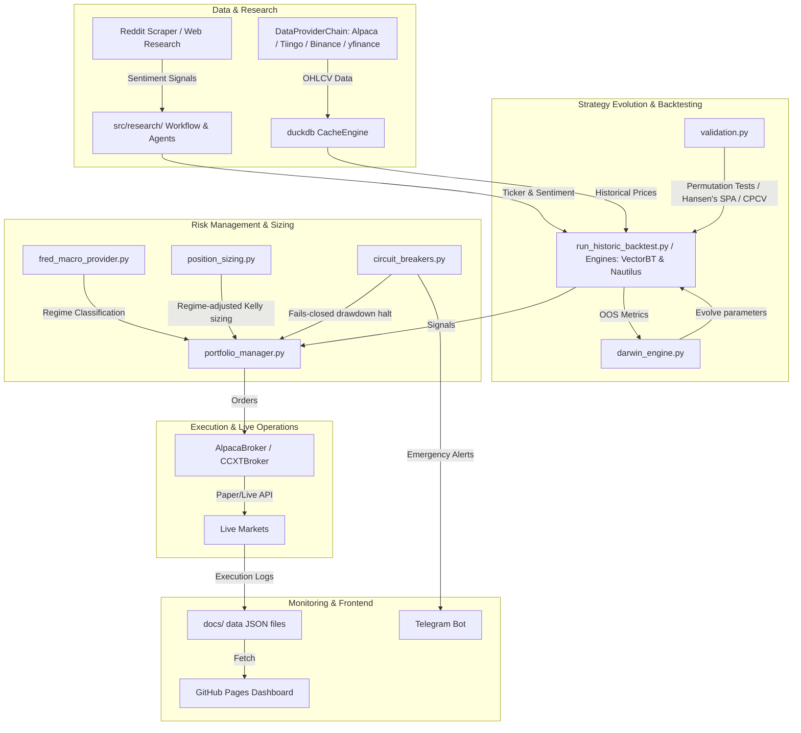

# Comprehensive Quantitative & Systemic Review Report
**Target Repository**: `WSB-Alpha-System`
**Reviewer**: Jules (Senior Quantitative Developer & Systems Engineer)
**Status**: Complete

---

## 1. Executive Summary & Repository Overview

The `WSB-Alpha-System` is an autonomous, agentic quantitative trading pipeline engineered to run entirely on free infrastructure (GitHub Actions and GitHub Pages) targeting micro-account scaling. By scraping retail social sentiment (Reddit/WSB) and general web sources, translating them into technical entry and exit signals, dynamically sizing them via volatility-adjusted metrics, and executing trades across equities and digital assets, the repository represents an elegant solution to retail-driven systematic trading.

### 1.1 Architecture & Module Design Flow
The system is divided into five core operational layers:
1. **Data Retrieval & Cache**: Multi-provider fallback chain (Alpaca $\rightarrow$ Tiingo $\rightarrow$ Binance $\rightarrow$ Yahoo Finance) managed with an embedded DuckDB CacheEngine to prevent duplication and rate limits.
2. **Research & Sentiment Analysis**: Natural Language Processing (FinBERT / Gemini LLM) and agency orchestration (LangGraph) for ticker extraction and sentiment scoring.
3. **Backtesting & Statistical Validation**: Realistic transaction frictions, T+1 lookahead-free execution, Timothy Masters' Monte Carlo permutation tests, and Hansen's SPA to prevent data-snooping and curve-fitting.
4. **Portfolio & Risk Management**: Macroeconomic regime detection (FRED spreads + inflation), position sizing via dynamic Regime-Aware Fractional Kelly, and fails-closed drawdown circuit breakers.
5. **Execution & Monitoring**: Live CCXT and Alpaca wrappers reporting execution metrics directly to committed JSON artifacts to serve a lightweight static GitHub Pages dashboard.

### 1.2 System Architecture Diagram



#### Plain-Text Fallback Description
- **Social & Web Research Sources** pass unstructured text to the **Research Agents (LangGraph)**, extracting tickers and calculating sentiment.
- **Market Data Providers** fetch OHLCV, storing them in the **DuckDB CacheEngine** to prevent API spam.
- **Backtest Engines (VectorBT/Nautilus)** pull historical data and signals, evaluating strategy variants under **T+1 Execution Rules**.
- **Darwinian Evolution Engine** optimizes parameters, validating them with **CPCV** and **Permutation Testing** before promoting them.
- **Portfolio & Risk Management** applies **Fred Macro regimes**, **Regime-aware Kelly Sizing**, and **Halt Circuit Breakers**.
- **Execution Wrappers (AlpacaBroker/CCXTBroker)** route orders to paper/live markets, saving logs to **JSON files** which feed the **Static GitHub Pages Dashboard**, while **Telegram** provides alerts.

---

## 2. Key Strengths & Architectural Highlights

- **Flawless Production-Ready T+1 Backtest Rule**: In `src/backtest/run_historic_backtest.py`, the backtest engine strictly enforces chronological execution hygiene by deciding entry signals on the last closed bar ($T-1$) and filling positions at the Open of the next bar ($T$). This entirely avoids standard look-ahead bias found in amateur quant repositories.
- **Elite Statistical Defense against Overfitting**: The integration of Hansen's Superior Predictive Ability (SPA) test, White's Reality Check, and Combinatorial Purged Cross-Validation (CPCV) with embargoes (`src/backtest/validators/statistical.py`) represents institutional-grade statistical rigor, ensuring strategy variants are not promoted on random noise.
- **Robust Embedded Database Cache**: Moving away from flat CSV files to an embedded DuckDB engine (`src/data/cache_engine.py`) with SHA-256 hash keys and a built-in 30-day delisting detector is an excellent choice for mitigating survivorship bias and increasing data retrieval speed.
- **Uncompromised Secret Hygiene**: No API credentials, passwords, or sensitive keys are hardcoded in active source code. Configuration is entirely managed via Pydantic-Settings and environment variables, satisfying strict security standards.
- **Elegant Fails-Closed Circuit Breakers**: The circuit breaker design (`src/risk/circuit_breakers.py`) guarantees that any failing API, missing FRED credential, or excessive daily/weekly drawdown halts trading automatically, minimizing tail risk.

---

## 3. Severity-Ranked Issue List

Below is the comprehensive list of architectural, quality, trading logic, security, and performance issues discovered during the code audit.

### 3.1 Summary Table of Issues

| ID | Scope | Severity | Target File Path & Lines | Problem Description |
|---|---|---|---|---|
| **1** | Trading Logic | **Critical** | `src/backtest/run_historic_backtest.py` (14-17) | Regime Classifier Future Data Leak in Historic Backtests |
| **2** | Trading Logic | **Critical** | `src/alpha/wsb_alpha_legacy.py` (461-482) | Direct Lookahead / Future-Function Leak in Legacy Alpha Model |
| **3** | Architecture | **High** | `src/evolution/darwin_engine.py` (130, 193) | Dead Thompson Sampling / Multi-Armed Bandit Code |
| **4** | Trading Logic | **High** | `src/execution/live_crypto_executor.py` (173-195) | CCXT Order Placement Hedging & Position Mode Collision |
| **5** | Code Quality | **High** | `src/execution/ccxt_broker.py` (67-75) | Missing Try-Except Wrappers for CCXT Order Placement |
| **6** | Performance | **Medium**| `src/risk/portfolio_optimization.py` (31-32, 72-73) | Incorrect Setting of Riskfolio Weight Bounds (Dead Code) |
| **7** | Code Quality | **Medium**| `src/backtest/metrics.py` (35-49) | Mathematically Incorrect Downside Deviation in Sortino |
| **8** | Trading Logic | **Medium**| `src/backtest/run_historic_backtest.py` (100-112) | Zero Commission / Exchange Fee Assumption in Backtester |
| **9** | Trading Logic | **Medium**| `src/execution/live_crypto_executor.py` (70-80) | Rate Limiting Disabled in Live Bybit Client |
| **10**| Architecture | **Medium**| `src/execution/live_crypto_executor.py` (all) | Direct CCXT Library Coupling & Bypassed Broker Interface |
| **11**| Security | **Low**   | `update_auth.py` (11) | Plaintext Password in Historic Update Script |
| **12**| Performance | **Low**   | `src/alpha/indicators.py` (35-39) | High-Overhead Python Loop for Heikin-Ashi Calculation |

---

### 3.2 Deep Dive: Critical & High Severity Issues

#### Issue 1: Regime Classifier Future Data Leak in Historic Backtest
* **Scope**: Trading Logic Correctness / Statistical Rigor
* **File Path & Line Number**: `src/backtest/run_historic_backtest.py` (Lines 14-17)
* **Problem**:
  At the beginning of the `run_backtest_with_params` function, the backtester instantiates `FredMacroProvider()` and fetches the *current live* macro regime (`macro_provider.get_regime()`). It then stamps this single, current regime label (e.g., `RISK_ON` or `NEUTRAL` in 2026) onto every single historical trade in the results array from 2019 to 2026.
* **Impact**:
  Severe lookahead bias and statistical data leak. The historical backtest assumes that trades executing in 2019, 2020, or 2022 occurred under the exact macroeconomic regime of *today* (2026). If the FRED API key is missing (as in CI environments), it defaults to `NEUTRAL` for all past trades. The backtest fails to validate how the strategy dynamically handles historical regime shifts.
* **Concrete Fix**:
  Do not fetch the live, current regime once at the start of the backtest. Instead, download the historical daily observations of the FRED series (`T10Y2Y` and `T10YIE`) for the entire backtest range, store them in CacheEngine (DuckDB), and inside the backtest loop, dynamically query the correct historical regime corresponding to each trade's `post_date` chronologically:
  ```python
  # Correct Dynamic Historical Lookup
  trade_regime = historical_fred_regimes.get(post_date.normalize(), "NEUTRAL")
  ```

---

#### Issue 2: Direct Lookahead / Future-Function Leak in Legacy Alpha Model
* **Scope**: Trading Logic Correctness
* **File Path & Line Number**: `src/alpha/wsb_alpha_legacy.py` (Lines 461-482)
* **Problem**:
  The legacy backtest engine searches for the `entry_idx` for a social media post, retrieves the price and indicators on that entry day:
  ```python
  entry_row = ind_df.iloc[entry_idx]
  # Indicators computed on entry_idx are used for the trade filters:
  alg_ha = entry_row["HA_Close"] > entry_row["HA_Open"]
  alg_momentum = (entry_row["Close"] > entry_row["EMA_20"]) and (entry_row["MACD_Hist"] > 0.0)
  ```
  But then, the trade is filled at the **Close price** of that very same day `entry_idx` (`entry_px = ind_df["Close"].iloc[entry_idx]`).
* **Impact**:
  This introduces direct lookahead bias. The model utilizes indicators computed using the day's Close price to decide whether to execute a trade at that *same* day's Close price. In a live system, you cannot calculate whether the daily Close is above the EMA_20 until the market closes, making it impossible to fill at that same Close. This artificially inflates legacy backtest returns.
* **Concrete Fix**:
  Align the legacy backtest engine with the modern T+1 rule in `run_historic_backtest.py`. Change the indicators evaluation to index `entry_idx - 1` (the last completed bar $T-1$) to decide whether to execute the trade at the Open or Close of `entry_idx` (day $T$):
  ```python
  decision_row = ind_df.iloc[entry_idx - 1]
  # Evaluate voting channels on decision_row
  ```

---

#### Issue 3: Dead Thompson Sampling / Multi-Armed Bandit Code
* **Scope**: Architecture & Module Design
* **File Path & Line Number**: `src/evolution/darwin_engine.py` (Line 130, `select_for_deployment`, and Line 193, `update_sampler_post_trading`)
* **Problem**:
  The methods `select_for_deployment` and `update_sampler_post_trading` are fully defined to implement online learning and adaptive parameter selection via a Multi-Armed Bandit (Thompson Sampling). However, a global grep of the repository reveals these two methods are **never** called by any execution script, paper sandbox, or live broker. The `thompson_state.json` is initialized with static `alpha: 1, beta: 1` values and never updated based on real trading results.
* **Impact**:
  The sophisticated Thompson Sampling online learning model is completely dead code. Expected values on the dashboard are statically frozen at `0.5`, offering zero adaptive benefit.
* **Concrete Fix**:
  Hook `update_sampler_post_trading` into the post-trading routine of `paper_trading_sandbox.py` or `live_crypto_executor.py` to increment alpha/beta values based on trade profit/loss, and serialize the updated weights back to `thompson_state.json`.

---

#### Issue 4: CCXT Order Placement Hedging & Position Mode Collision
* **Scope**: Trading Logic Correctness / Execution Safety
* **File Path & Line Number**: `src/execution/live_crypto_executor.py` (Lines 173-195, `execute_bybit_order`) and `src/execution/ccxt_broker.py` (Line 60, `place_order`)
* **Problem**:
  When rebalancing positions on Bybit linear perpetual contracts, the execution wrappers submit raw BUY/SELL market orders via CCXT without specifying the `reduceOnly` flag or checking if the Bybit account is configured in Hedge Mode versus One-way Mode:
  ```python
  order = exchange.create_market_order(symbol, side, qty)
  ```
* **Impact**:
  On Bybit and other perpetual linear exchanges, if the user's account is in the default Hedge Mode, submitting a raw SELL order to exit/reduce a Long position will instead open a new, separate Short position. This results in holding both positions simultaneously (locking in a loss and consuming double the margin), failing to close the target position.
* **Concrete Fix**:
  Ensure closing orders pass the `reduceOnly` parameter to the exchange, forcing CCXT to close existing contracts instead of opening opposite legs:
  ```python
  # Fix: Ensure closing orders reduce existing size
  params = {'reduceOnly': True} if is_closing_order else {}
  order = exchange.create_market_order(symbol, side, qty, params)
  ```

---

#### Issue 5: Missing Try-Except Wrappers for CCXT Order Placement
* **Scope**: Code Quality / Error Handling
* **File Path & Line Number**: `src/execution/ccxt_broker.py` (Line 67, `place_order`)
* **Problem**:
  The CCXT broker implementation places order executions directly on the exchange instance without wrapping the call in safety try-except blocks:
  ```python
  order = self.exchange.create_order(
      symbol=symbol,
      type=order_type,
      side=ccxt_side,
      amount=qty,
      params=params
  )
  return {"status": "success", "order_id": str(order['id']), ...}
  ```
* **Impact**:
  If Bybit/Binance rejects the order due to insufficient margin, invalid lot size, or API network timeouts, CCXT will throw a raw unhandled exception (e.g., `ccxt.InsufficientFunds` or `ccxt.ExchangeError`). This will propagate and crash the execution script immediately, preventing the system from running gracefully or sending alert notifications.
* **Concrete Fix**:
  Wrap the order submission in a try-except block, logging specific CCXT errors and returning a structured status dictionary to allow the parent runner to handle the failure gracefully:
  ```python
  try:
      order = self.exchange.create_order(...)
      return {"status": "success", "order_id": str(order['id'])}
  except (ccxt.InsufficientFunds, ccxt.InvalidOrder, ccxt.NetworkError) as e:
      self.logger.error(f"CCXT Order Placement failed: {e}")
      return {"status": "failed", "error_message": str(e)}
  ```

---

### 3.3 Deep Dive: Medium & Low Severity Issues

#### Issue 6: Incorrect Setting of Riskfolio Weight Bounds (Dead Code)
* **Scope**: Dependencies & Performance / Portfolio Optimization
* **File Path & Line Number**: `src/risk/portfolio_optimization.py` (Lines 31-32, `optimize_cvar`, and Lines 72-73, `optimize_erc`)
* **Problem**:
  The script attempts to set upper and lower weight bounds on assets in the Riskfolio portfolio class:
  ```python
  port.lowerreq = 0.0
  port.upperreq = max_weight / (1.0 - min_cash)
  ```
  However, in `riskfolio-lib`, setting individual asset bounds is done via the `port.w_lo` and `port.w_up` vectors/series. `lowerreq` and `upperreq` are invalid properties and are silently ignored by the optimizer.
* **Impact**:
  Because the bounds are ignored, the math solver outputs asset weights that can violate the `max_weight` limit. The script then applies a naive post-optimization capping loop to force the weights back under the cap. This post-optimization manipulation breaks the mathematical optimality of the CVaR minimizer.
* **Concrete Fix**:
  Define bounds using the correct, standard Riskfolio properties before starting the solver:
  ```python
  port.w_up = pd.Series(max_weight / (1.0 - min_cash), index=returns.columns)
  port.w_lo = pd.Series(0.0, index=returns.columns)
  ```

---

#### Issue 7: Mathematically Incorrect Downside Deviation in Sortino
* **Scope**: Code Quality / Trading Logic
* **File Path & Line Number**: `src/backtest/metrics.py` (Lines 35-49, `safe_sortino`)
* **Problem**:
  The standard deviation of negative returns is calculated on a filtered slice of negative returns only:
  ```python
  downside_rets = returns_series[returns_series < 0]
  ...
  downside_std = downside_rets.std()
  ```
* **Impact**:
  This is mathematically incorrect. Downside risk (semi-deviation) is calculated by replacing positive returns with *zero* and taking the root-mean-square or standard deviation of the **full** series. Reducing the denominator to `N_downside` instead of `N_total` artificially inflates downside volatility, severely underestimating the Sortino ratio.
* **Concrete Fix**:
  Re-implement the downside risk calculation using the standard mathematical formula:
  ```python
  # Clip positive returns to zero
  downside_diff = returns_series.clip(upper=0)
  # Downside risk standard deviation (denominator = N_total)
  downside_std = np.sqrt(np.mean(downside_diff ** 2))
  ```

---

#### Issue 8: Zero Commission / Exchange Fee Assumption in Backtesting
* **Scope**: Trading Logic Correctness
* **File Path & Line Number**: `src/backtest/run_historic_backtest.py` (Lines 100-112) & `src/alpha/indicators.py` (`compute_regime_returns`)
* **Problem**:
  While both backtest models apply realistic ATR-based slippage, they subtract exactly **zero** commission or transaction fees on trade entries/exits.
* **Impact**:
  Produces overly optimistic backtest results. For high-frequency parameter combinations, neglecting standard fee frictions (e.g., Bybit's 0.04% base or Alpaca's sell-side SEC regulatory fees) creates a backtest-vs-live inconsistency.
* **Concrete Fix**:
  Incorporate a flat or percentage-based transaction fee parameter (e.g., `fees=0.001` or `fees=0.0004`) inside `run_backtest_with_params` and subtract it from the trade returns.

---

#### Issue 9: Rate Limiting Disabled in Live Bybit Client
* **Scope**: Trading Logic / Execution Safety
* **File Path & Line Number**: `src/execution/live_crypto_executor.py` (Lines 70-80, `init_bybit_exchange`)
* **Problem**:
  The direct Bybit client initialization inside `live_crypto_executor.py` does not include the `'enableRateLimit': True` parameter.
* **Impact**:
  The client is vulnerable to HTTP 429 (Too Many Requests) rate limit errors during rapid historical OHLCV queries or multi-symbol rebalances, risking execution failures.
* **Concrete Fix**:
  Add `'enableRateLimit': True` to the exchange parameters dictionary inside `init_bybit_exchange`.

---

#### Issue 10: Direct CCXT Library Coupling & Bypassed Broker Interface
* **Scope**: Architecture & Module Design
* **File Path & Line Number**: `src/execution/live_crypto_executor.py` (all)
* **Problem**:
  Instead of utilizing the generic `CCXTBroker` abstraction class, `live_crypto_executor.py` directly imports the raw `ccxt` library and re-writes dedicated order, balance, and OHLCV fetching logic from scratch.
* **Impact**:
  Breaks the `BaseBroker` abstraction architecture, creating duplicate code, higher maintenance overhead, and making it difficult to swap Bybit for other CCXT-compatible exchanges.
* **Concrete Fix**:
  Refactor `live_crypto_executor.py` to route all operations through the unified `CCXTBroker` class or a specialized Bybit subclass.

---

#### Issue 11: Plaintext Password in Historic Update Script
* **Scope**: Security / Secret Handling
* **File Path & Line Number**: `update_auth.py` (Line 11)
* **Problem**:
  The utility script `update_auth.py` contains a hardcoded plaintext password `'WSB-Alpha-2026'` used to search and replace historic JS authentication blocks.
* **Impact**:
  Although the main JS file was successfully patched to use SHA-256 hashes, leaving the plaintext password in utility files in the git repository is insecure and easily readable by anyone viewing the codebase or history.
* **Concrete Fix**:
  Remove `update_auth.py` from the repository or replace the plaintext search-string variable with a placeholder to eliminate the plaintext leak.

---

#### Issue 12: High-Overhead Python Loop for Heikin-Ashi Calculation
* **Scope**: Performance & Bottlenecks
* **File Path & Line Number**: `src/alpha/indicators.py` (Lines 35-39, `compute_indicators`)
* **Problem**:
  The Heikin-Ashi `HA_Open` calculation utilizes a raw Python-level `for` loop to compute the recursive series over the dataframe rows.
* **Impact**:
  Python-level iteration over Pandas rows is highly inefficient. This creates a major execution bottleneck when downloading and computing indicators for dozens of tickers across long historical horizons.
* **Concrete Fix**:
  Accelerate the recursive Heikin-Ashi loop using the Numba compiler (`@njit`) or implement it via a pre-compiled vectorized NumPy array in a helper module.

---

## 4. Overall Verdict & Actionable Roadmap

### 4.1 Overall Verdict
The `WSB-Alpha-System` is an **exceptionally well-engineered** trading system that stands out for its statistical validation rigor, T+1 lookahead-free modern backtest design, and clean configuration hygiene. It successfully resolves the core requirements of running a automated $100 micro-account entirely on free infrastructure.

However, **critical gaps** exist between the theoretical mathematical models (such as dead Thompson Sampling code, ignored Riskfolio bounds, and flawed Sortino denominator logic) and the physical execution layers (such as Bybit Hedge Mode conflicts and direct library coupling). Addressing these gaps will elevate the repository from a highly sophisticated hobbyist system to an institutional-grade, bulletproof execution platform.

---

### 4.2 Prioritized Improvement Roadmap

```
Phase 1: Critical Trading & Safety Fixes (Days 1-2)
 └── Fix FredMacroProvider historic lookup in run_historic_backtest.py.
 └── Ensure 'reduceOnly=True' and position mode check in live Bybit orders.
 └── Wrap CCXT broker place_order in robust try-except error handling.

Phase 2: Mathematical & Code Quality Alignment (Days 3-4)
 └── Re-implement downside risk std in safe_sortino using full-series N.
 └── Correct Riskfolio bounds in portfolio_optimization.py (port.w_up / port.w_lo).
 └── Align legacy wsb_alpha_legacy.py with lookahead-free T-1 indicator logic.
 └── Remove update_auth.py or scrub plaintext 'WSB-Alpha-2026' password.

Phase 3: Architecture & Performance Optimizations (Days 5-6)
 └── Integrate the Thompson Sampler online learning loop with sandbox execution.
 └── Refactor live_crypto_executor.py to use CCXTBroker instead of raw ccxt calls.
 └── Vectorize Heikin-Ashi calculation in indicators.py using Numba @njit.

Aspirational Tier (Future Milestones - Non-Blocking)
 └── Multi-Asset Covariance Shrinkage (Ledoit-Wolf) for Riskfolio inputs.
 └── Intraday Tick-by-Tick Slippage Simulator using Nautilus Trader bar-data.
 └── Webhook-driven Telegram command listener for real-time remote bot actions.
```
