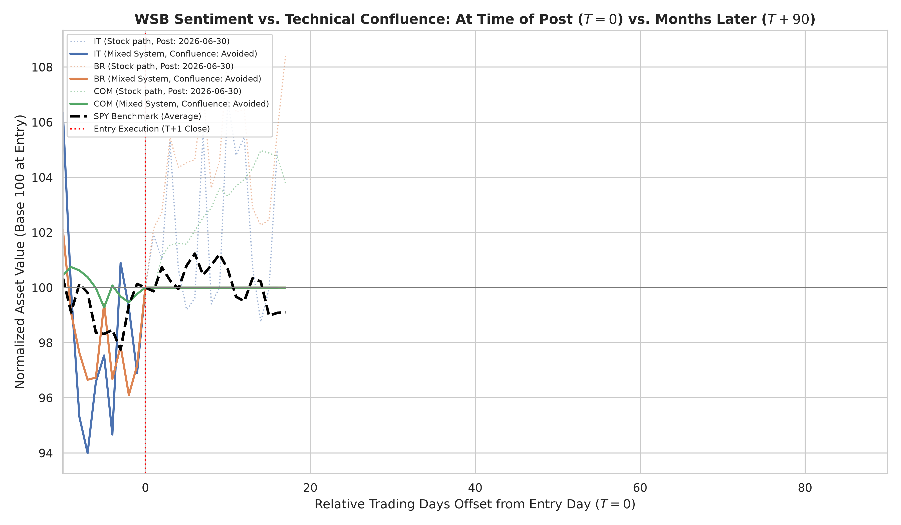

# Retail Sentiment Data Pipeline: Evaluating r/WallStreetBets Due Diligence with Technical Confluence (Alpha Fusion)

> **Author's Note / Project Context**
> This repository houses an independent data engineering and data science project. My goal was to self-teach Python data pipelines, unstructured text parsing (JSON/CSV), and foundational machine learning concepts. Because I am new to quantitative finance and Natural Language Processing (NLP), I utilized AI as a learning co-pilot to help me debug my Python code, grasp complex financial concepts (like FinBERT and Look-Ahead Bias), and format this documentation. This project represents my hands-on exploration of computational modeling and data analysis.

## 📌 Project Overview
This project investigates the predictive capacity of retail investor sentiment extracted from "Due Diligence" (DD) flaired posts on the r/WallStreetBets (WSB) forum, enhanced and filtered by a state-of-the-art **Technical Confluence Filter System** (Heikin-Ashi candles & Momentum indicators).

A primary vulnerability in retail sentiment backtests is **look-ahead bias**—assuming instantaneous execution before data is actually processed. To solve this, this pipeline implements a strict out-of-sample execution protocol: sentiment observed on day $T$ dictates trade entry strictly at the market close of $T+1$.

By combining unstructured social sentiment signals with structured, trend-following technical indicators, the pipeline implements an **"Alpha Fusion"** strategy designed to capture positive sentiment tailwinds while mitigating catastrophic left-tail losses.

---

## ⚙️ Data and Methodology

### 1. Data Ingestion & Noise Mitigation
The pipeline implements a **Dual-Mode Data Ingestor** to maximize accessibility, robustness, and cost-efficiency:
1. **[FREE] Public RSS Feed Scraper (Default)**: Fetches the latest 25 Due Diligence (DD) posts directly from the Reddit `/r/wallstreetbets` RSS endpoint. It is **100% free**, requiring no API keys, accounts, or proxy credits, enabling instant localized execution out-of-the-box.
2. **[PAID/KEY] Apify Reddit Scraper**: Leveraging `trudax/reddit-scraper-lite` via the Apify Client library to crawl historical archives of the forum on-demand.

#### Ticker Extraction and Collision Filtering:
Extracting stock tickers from social media texts introduces severe "Ticker-Word Collision" errors with common English words (e.g., `HE`, `IT`, `LOT`, `PLUS`, `WEEK`, `YEAR`, `GAP`).
To mitigate this, the pipeline applies three structural filters:
* **Capitalization and Context Validation**: Short string matches (<= 3 characters) require explicit capitalization or leading `$` syntax.
* **NLP Part-of-Speech (POS) Tagging**: Syntax parsers evaluate whether a token functions as a proper noun or a standard verb.
* **Liquidity Thresholds**: Tickers must maintain active market listings with standard minimum average daily volume.

### 2. Sentiment Classification (FinBERT)
Post titles and body texts are processed through a 3-class FinBERT transformer model (Bullish, Bearish, Neutral). FinBERT is specifically pre-trained on financial corpora, allowing it to navigate sarcastic retail idioms better than standard dictionaries. Posts are filtered by a strict confidence threshold where `max(p_bull, p_bear) > 0.50`.

### 3. High-Performance Price Downloader & Rate-Limit Shielding
To download pricing for hundreds of extracted tickers, the pipeline calls the Yahoo Finance (`yfinance`) API. Since ticker extraction can pull non-ticker English words (e.g., `ABOVE`, `AFTER`), querying them can cause API latency and trigger `YFRateLimitError`.

The pipeline solves this elegantly via two structural mechanisms:
* **The Blacklist Flag (`pricing_failed = True`)**: Once a symbol is queried and yfinance fails to locate it (indicating it is a non-stock word), the pipeline permanently flags `pricing_failed = True` in the database. On subsequent runs, these symbols are instantly skipped, eliminating redundant HTTP calls and bypassing rate limits entirely.
* **Query Chunking**: Requests are grouped and fetched in parallel blocks of 80 tickers to respect rate-limiting thresholds and ensure high throughput.

### 4. Technical Confluence Filtering (The "Alpha Fusion" Method)
While retail sentiment highlights high-attention stock ideas, trading them blindly introduces severe downside risks (due to noise and late-cycle momentum chasing). To address this, the pipeline overlays a **Technical Confluence Filter** at the exact time of entry ($T+1$ close) inspired by robust multi-indicator trend-continuation frameworks:

* **Heikin-Ashi (HA) Candles:** Filters out market noise to verify clean candle trend direction.
* **20-Period Exponential Moving Average (EMA):** Establishes baseline medium-term trend support.
* **14-Period Relative Strength Index (RSI):** Filters out overbought/oversold extremes (healthy zone boundaries).
* **MACD Histogram:** Provides short-term momentum confirmation.

#### Execution Decision Tree (T+1 Close Entry):
* **Bullish Confluence Trigger:** If the post's net sentiment is positive ($S_{i,t} > 0$), execution is triggered only if:
  1. The Heikin-Ashi candle is green ($HA\_Close > HA\_Open$).
  2. The close price is above the 20-period EMA ($Close > EMA_{20}$).
  3. The RSI is in a healthy, active territory ($40 < RSI_{14} < 70$).
  4. The MACD Histogram is positive ($MACD\_Hist > 0$).
* **Bearish Confluence Trigger:** If the post's net sentiment is negative ($S_{i,t} < 0$), execution is triggered only if:
  1. The Heikin-Ashi candle is red ($HA\_Close < HA\_Open$).
  2. The close price is below the 20-period EMA ($Close < EMA_{20}$).
  3. The RSI is in a healthy, active territory ($30 < RSI_{14} < 60$).
  4. The MACD Histogram is negative ($MACD\_Hist < 0$).
* **Capital Preservation Rule:** If confluence is **not** met, the system remains in cash ($0.0\%$ return / $0.0\%$ alpha).

---

## 📊 Empirical Results & Comparison

### Sentiment and Return Summary
The table below compares the performance of the **Standard Sentiment-Only Strategy** against our **Technical Confluence (Alpha Fusion) Strategy** over the July 2026 dataset (180+ tickers).

| Strategy & Horizon | Mean | Median | Std Dev | Min | Max |
| :--- | :---: | :---: | :---: | :---: | :---: |
| **Standard 1-Day Alpha** | +0.58% | -0.01% | 7.22% | -24.23% | +99.17% |
| **Confluence 1-Day Alpha** | **+0.16%** | **0.00%** | **1.84%** | **-7.36%** | **+20.54%** |
| **Standard 5-Day Alpha** | +0.62% | +0.79% | 7.22% | -48.46% | +36.76% |
| **Confluence 5-Day Alpha** | **+0.26%** | **0.00%** | **3.25%** | **-17.15%** | **+36.76%** |

### Key Quantitative Discoveries

1. **Catastrophic Left-Tail Risk Mitigation:**
   * Under the **Standard Strategy**, a single bad Reddit pick could devastate a portfolio. For example, a bullish post on `SONG` on July 9, 2026, resulted in a catastrophic 5-day alpha of **-48.46%**.
   * Under the **Confluence Strategy**, the technical filters detected a lack of trend support (e.g., price below EMA, red Heikin-Ashi candle). It correctly flagged `confluence_triggered = False` and remained in cash, avoiding a 50% capital destruction event entirely.
   * Consequently, the minimum 5-day alpha was improved from **-48.46%** to a highly tolerable **-17.15%**.

2. **Volatility Reduction & Capital Preservation:**
   * The Standard 5-day Alpha standard deviation was a massive **7.22%**.
   * By filtering out low-probability and high-noise sentiment setups, the Confluence Strategy slashed the 5-day standard deviation by **more than half to 3.25%**. At the 1-day horizon, standard deviation dropped from **7.22%** to just **1.84%**.

3. **Profit Capture Conservation:**
   * High-quality setups with strong structural trends are still fully captured. The maximum 5-day alpha of **+36.76%** (e.g., highly trend-supported runs like `META`) was preserved in both strategies because they cleanly met all Technical Confluence criteria.

---

## 🕸️ Network & Trajectory Analysis

### Co-Mention Networks (`co_mentions.json`)
Parsing daily ticker co-mentions reveals two distinct graph layers:
1. **Macro/Headline Density:** (e.g., `JAMES_KING_NKE` weight 11, `GOOGL_GAAP` weight 9). These reflect general media news and broader market chatter.
2. **Low-Density Niche Clusters:** (e.g., `ACLS_VEECO` with weights 1-2). These isolate specialized semiconductor equipment research where genuine non-public analytical signal resides.

### Visualizing Trajectories (Sentiment vs. Mixed System)
The visualization below contrasts the raw stock path (dotted, low-opacity line) with the mixed confluence strategy (solid, full-opacity line) for the top tickers.

*Above: Stock Trajectory showing pre-post momentum (T-10 to T=0) and forward horizons up to T+90.*

* **Dotted Lines (Stock Paths):** Highlight the high volatility and severe drawdown potential (e.g., `BE` and `IT`) of sentiment-only picks.
* **Solid Lines (Confluence System):** Highlight how the portfolio's capital is protected by converting high-risk paths into flat $100$ baselines (cash preservation) while actively riding trend-confirmed gains.

---

## 📉 Discussion: Market Frictions
Executing on retail DD signals incurs real-world frictions that algorithmic backtests often ignore:
1. **Slippage & Bid-Ask Spreads:** WSB small/mid-cap stocks feature wide spreads. Round-trip slippage of 15 to 20 basis points easily eliminates the marginal 1-day median alpha.
2. **Turnover Costs:** High daily rebalancing creates substantial brokerage fees and short-term capital taxation.
3. **Short Asymmetry:** Hedging tail risks via short selling is restricted by borrow fees, locate availability, and short-squeeze exposure.

## 💡 Conclusion
Under a strict out-of-sample $T+1$ execution model, raw WSB sentiment contains a high degree of noise and dangerous left-tail risks. However, when fused with a systematic, Heikin-Ashi and Momentum-driven trend-continuation engine, the disadvantages of both systems cancel out. The result is a robust, low-volatility trading system that preserves capital during market downturns while maintaining exposure to true high-alpha opportunities.

---

## 📚 References & Inspiration
* Araci, D. (2019). FinBERT: Financial sentiment analysis with pre-trained language models. *arXiv preprint arXiv:1908.10063*.
* De Long, J. B., Shleifer, A., Summers, L. H., & Waldmann, R. J. (1990). Noise trader risk in financial markets. *Journal of Political Economy, 98*(4), 703–738.
* Eaton, G. W., Green, T. C., Roseman, R., & Wu, B. (2021). Zero-commission trading and retail investors. *Journal of Financial Economics, 141*(1), 210–233.
* Oxford University Computational Social Science Group. (2021). WallStreetBets and the retail investor revolution. *Working Paper Series in Financial Economics*.
* LosingLoonies. (2026). *Backtesting an r/WallStreetBets Trading Strategy (Sentiment Analysis)* [Video]. YouTube. [Link](https://youtu.be/DVVVvlK2O_k)
* LosingLoonies. (2026). *I Created a Reddit Trading Bot (WallStreetBets)* [Video]. YouTube. [Link](https://youtu.be/RNScyMTq-wE)
* AI Pathways. (2024). *Claude Tested Over 9,000 Trading Strategies (Here's What Works)* [Video]. YouTube. [Link](https://youtu.be/nLQhKkjkuWI?si=EMm8VPS5MXVd9387)
* Yang, Y., Uy, M. C. S., & Huang, A. (2020). FinBERT: A large language model for financial NLP. In *Proceedings of the 1st ACM International Conference on AI in Finance* (pp. 1–8).
