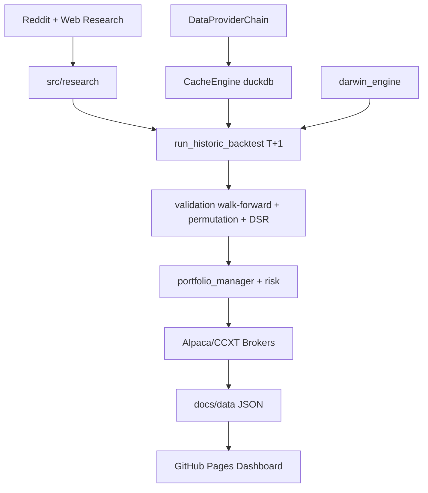

# WSB-Alpha-System

> **Autonomous, agentic quant trading system — retail sentiment → statistically-hardened strategies → paper execution — entirely on GitHub free tier (Actions + Pages).**

[](requirements.txt)
[](https://github.com/pandejesal/WSB-Alpha-System/actions/workflows/ci.yml)
[](https://github.com/pandejesal/WSB-Alpha-System/actions/workflows/pages.yml)
[](#license)
[](https://docs.astral.sh/ruff/)
[](bandit.toml)

Live dashboard: `https://pandejesal.github.io/WSB-Alpha-System/` · Paper trading at **3:55 PM ET (20:55 UTC) Mon–Fri** · `LIVE_TRADING_ENABLED=False` by default.

---

## Table of Contents

- [What it is](#what-it-is)
- [Architecture](#architecture)
- [Repository Layout](#repository-layout)
- [Strategies & Registry](#strategies--registry)
- [Data Layer — Providers & Cache](#data-layer--providers--cache)
- [Research Layer](#research-layer)
- [Backtesting & Statistical Validation](#backtesting--statistical-validation)
- [Risk Management](#risk-management)
- [Execution Layer](#execution-layer)
- [Ops — Daily Check, Gates & Monitoring](#ops--daily-check-gates--monitoring)
- [Hunt Protocol — Discovering New Families](#hunt-protocol--discovering-new-families)
- [GitHub Actions — 14 Pipelines](#github-actions--14-pipelines)
- [Dashboard (GitHub Pages)](#dashboard-github-pages)
- [Getting Started](#getting-started)
- [Configuration](#configuration)
- [Scripts Reference](#scripts-reference)
- [Testing & Quality Gates](#testing--quality-gates)
- [Documentation Index](#documentation-index)
- [Known Limitations & Honest-Claims Policy](#known-limitations--honest-claims-policy)
- [Contributing & Agent Guidelines](#contributing--agent-guidelines)
- [Disclaimer](#disclaimer)

---

## What It Is

WSB-Alpha-System scrapes retail sentiment (Reddit/PRAW + agentic web research + Gemini 2.5 Flash), prices a liquid US equity + crypto universe through a **4-tier OHLCV fallback chain**, runs **lookahead-free (T+1) backtests** with realistic frictions, gates every candidate through **permutation / walk-forward / deflated-Sharpe** statistical checks, evolves parameters with a DERM-style engine that only promotes on OOS evidence, paper-trades every weekday via Alpaca/CCXT with risk-capped sizing, and publishes a static dashboard to GitHub Pages.

Design mandates:

- **Fail-closed** — missing credentials, stale data, or API failure halts new orders; never silent mock fallbacks (see `src/execution/ccxt_broker.py:67`, `src/backtest/run_historic_backtest.py:8`, `src/ops/gate_evaluator.py:128`).
- **No lookahead** — decisions on `T-1` close, fills at `T` open, next business day (`src/backtest/run_historic_backtest.py:52-64`, asserted in `tests/test_session4_lookahead.py`).
- **Honest claims** — pre-registration before any backtest, no cherry-picking (`scripts/preregister.py`, `docs/HUNT_PROTOCOL.md:54`).
- **Zero-cost hosting** — all automation in GitHub Actions; no paid infra required.

Current scale (2026-08-29): **130 Python modules** in `src/`, **15 strategy specs** (`strategies/*.yaml`), **8 ported strategies** in `strategies/registry.json`, **14 workflows**, **~48 test modules**, market data back to **2019** in `market_data_2019_2026/`.

---

## Architecture

```
              ┌─────────────────────────────────────────────────┐
              │              Social & Web Research               │
              │  Reddit (PRAW) · DuckDuckGo · Gemini 2.5 Flash  │
              │  Agentic Scraper (Playwright) · Debate Engine    │
              └──────────────────────┬──────────────────────────┘
                                     │ ticker + sentiment
                                     ▼
              ┌─────────────────────────────────────────────────┐
              │           OHLCV Market Data (Fallback Chain)      │
              │  Alpaca → Tiingo → Binance Public → yfinance     │
              │  CacheEngine (DuckDB) · incremental backfill     │
              │  FRED T10Y2Y/T10YIE → Regime (RISK_ON/OFF/...)  │
              └──────────────────────┬──────────────────────────┘
                                     │ bars + regimes
                                     ▼
              ┌─────────────────────────────────────────────────┐
              │         Backtest & Statistical Validation        │
              │  run_historic_backtest.py (T+1, ATR slippage)   │
              │  VectorBT / Nautilus engines · CPCV · Embargo   │
              │  Permutation (Masters) · White's Reality Check  │
              │  Deflated Sharpe (trial_ledger) · Walk-Forward  │
              └──────────────────────┬──────────────────────────┘
                                     │ OOS metrics + p-values
                                     ▼
              ┌─────────────────────────────────────────────────┐
              │           Evolution & Self-Improvement            │
              │  darwin_engine.py (complexity penalty, DSR)     │
              │  self_improvement_agent.py (1 param/week)       │
              │  strategy_research_agent.py (real web search)   │
              └──────────────────────┬──────────────────────────┘
                                     │ promoted specs → registry
                                     ▼
              ┌─────────────────────────────────────────────────┐
              │           Risk & Portfolio Management             │
              │  position_sizing.py (Kelly-fractional, 24/7)   │
              │  portfolio_manager.py · circuit_breakers.py     │
              │  gate_evaluator.py (G1–G7) · killswitch.py     │
              └──────────────────────┬──────────────────────────┘
                                     │ sized orders
                                     ▼
              ┌─────────────────────────────────────────────────┐
              │              Execution & Brokers                  │
              │  AlpacaBroker · CCXTBroker · UniversalBroker    │
              │  live_alpaca_executor · live_crypto_executor   │
              │  paper_trading_sandbox · capability gates       │
              └──────────────────────┬──────────────────────────┘
                                     │ fills + logs
                                     ▼
              ┌─────────────────────────────────────────────────┐
              │           Ops, Monitoring & Dashboard             │
              │  ops/daily.py (check mode, ~100 tickers)        │
              │  heartbeat.py · signals.py · alerts.py          │
              │  docs/data/*.json → docs/index.html (Pages)    │
              │  Telegram Bot (warn on missing creds)           │
              └─────────────────────────────────────────────────┘
```

Mermaid source (for `docs/` renderers):



---

## Repository Layout

```
WSB-Alpha-System-build/
├── .github/workflows/        14 pipelines (ci, pages, daily_research, paper_trade, ops_*, ...)
├── config/
│   ├── universe.json         Ticker universe (18 equities + BTC/USD, ETH/USD)
│   ├── settings.yaml         environment: development (trading flags via .env)
│   ├── risk_config.py        Risk limits (imported by position_sizing / portfolio_manager)
│   └── ops_state.yaml        Ops state machine checkpoint
├── docs/
│   ├── index.html / css/ / js/app.js    Static dashboard (Tailwind + vanilla JS, no build)
│   ├── data/                 Backtest artifacts (backtest_report.json, strategies.json,
│   │                         equity_curve.json, trades.json, permutation_study.json, ...)
│   │   └── ops/              plan.json, heartbeat.json, fills, reconciliation, etc.
│   ├── BLUEPRINT.md          Quant overhaul blueprint (SMC, sizing, walk-speed gates)
│   ├── HUNT_PROTOCOL.md      Hunt session contract (brief → prereg → validation → ledger)
│   ├── OPTIMIZATION_PLAYBOOK.md  Muse Spark 1.2 XHigh pipeline (bridges, memory, CI)
│   ├── PIPELINE_GATE.md      30-day victory gate (knowledge/episodic/hunt PASS)
│   ├── LIVE_DESIGN.md / PIPELINE_GATE / adr/  Additional design & ADRs
│   ├── arxiv_qfin/ / *_REPORT.md  arXiv q-fin research corpus
│   └── build/                (generated site; not hand-edited)
├── hunts/                    Hunt factory: ta-rules, sentiment-overlay, xgboost-exits, multi-factor
│   └── <family>/candidates/  Candidate specs + results/ per hunt run
├── strategies/
│   ├── registry.json         Canonical portfolio + 8 strategy entries (ranked, gates_passed)
│   ├── flagship_portfolio_v1.yaml  Inverse-vol 12m flagship allocation
│   ├── us_momentum_top5.yaml / spy_sma200.yaml / spy_rsi2.yaml
│   ├── btc_vol_target_sma100.yaml / dual_momentum.yaml / us_lowvol_top30.yaml / ...
│   └── _template.yaml        Spec template for new families
├── src/
│   ├── alpha/                SMC, WSB sentiment alpha, Man-AHL legacy, indicators (864 lines), order_blocks
│   ├── backtest/             run_historic_backtest.py, metrics.py (safe_sharpe/sortino),
│   │                         engines/ (vectorbt, nautilus), defend/ (trial_ledger DSR),
│   │                         permutation_tester.py, walk_forward_engine.py, validation.py:286
│   ├── data/                 providers/chain.py (DataProviderChain), alpaca/tiingo/binance/yfinance,
│   │                         cache_engine.py (duckdb, hash-keyed, dedup), market_data.py, nautilus_catalog.py
│   │                         openbb_compat/ (ProviderAdapter + Registry, Step 1/5)
│   ├── evolution/            darwin_engine.py (evolution + promotion gate), strategy_selector.py
│   ├── execution/            base_broker.py, alpaca_broker.py, ccxt_broker.py, universal_broker.py,
│   │                         live_alpaca_executor.py, live_crypto_executor.py, paper_executor.py, async_executor.py
│   ├── gs_compat/            Vendored NYSE GSCalendar + Window (Step 1/5)
│   ├── monitoring/           telegram_bot.py (False + warning if creds missing), dashboard.py (stub)
│   ├── ops/                  daily.py (check mode, 100-ticker S&P 100 slice), signals.py (662 lines, 8 families),
│   │                         gate_evaluator.py (G1-G7), heartbeat.py, killswitch.py, strategy_registry.py, alerts.py
│   ├── research/             reddit_scraper.py, ticker_extractor.py, nlp_utils.py, debate_engine.py,
│   │                         strategy_research_agent.py, self_improvement_agent.py, agentic_scraper.py
│   ├── risk/                 fred_macro_provider.py (RISK_ON/OFF/STAGFLATION/NEUTRAL), position_sizing.py,
│   │                         portfolio_manager.py, circuit_breakers.py, portfolio_optimization.py
│   ├── sandbox/              Paper sandbox harness
│   ├── signals/              Legacy/alt signal engine (api.py, engine.py)
│   ├── utils/                config.py (pydantic-settings + .env + settings.yaml), gemini_provider.py
│   └── ops/ … (see above)
├── scripts/
│   ├── run_full_backtest.py / comprehensive_backtest_report.py / generate_strategy_data.py
│   ├── paper_trading_sandbox.py (--day 1..5) / run_paper_execution.py / run_research.py
│   ├── hunt_runner.py (run/collect/status) / preregister.py (freeze/record)
│   ├── evaluate_candidate.py / eval_new_specs.py / port_validation.py
│   ├── fetch_sp500_universe.py / refresh_market_data.py / reconcile.py / kill_switch_rehearsal.py
│   ├── cycle{3,4,5}_*_engine.py  Cycle-specific mega-engines
│   └── update_dashboard.py / verify_backtest_local.py
├── tests/                    ~48 modules (indicators, providers, backtest, validation, execution, risk, ops, walk_forward, ...)
│   ├── analytics/ / backtesting/ / brokers/ / paper_trading/ / signals/ / storage/
│   └── test_session4_lookahead.py  T+1 invariant
├── market_data_2019_2026/    Harvested 2019–2026 OHLCV, fundamentals, 13F, GDELT (git-ignored internals, see launch/)
├── launch/                   Overnight harvest pack (run_forever.md + tasks A-D + runlog/)
├── requirements.txt          169 pinned deps (alpaca-py, ccxt, duckdb, vectorbt, nautilus_trader 1.218, yfinance, ...)
├── bandit.toml / .env.example / AGENTS.md
└── README.md                 (this file)
```

Top-level workspace (`C:\Users\DELL\Documents\Default Project`) additionally contains the Obsidian vault (`Obsidian Vault/`), `opencode.json`, curated skills, and tooling — see `AGENTS.md` for the memory-layer protocol.

---

## Strategies & Registry

`strategies/registry.json` is the **single source of truth** the ops pipeline and `src/ops/signals.py:762 generate_signals_from_registry` consume without code changes.

| # | ID | Name | Family | Venue | Gates | Status |
|---|----|------|--------|-------|-------|--------|
| 1 | `us_momentum_top5` | US Cross-Sectional Momentum Top-5 (no regime filter) | momentum | alpaca | 5/5 | ported |
| 2 | `spy_sma200` | SPY SMA-200 Trend Timing | trend | alpaca | 4/5 | ported |
| 3 | `spy_rsi2` | SPY RSI(2) Mean Reversion (buy-the-dip) | mean_reversion | alpaca | 4/5 | ported |
| 4 | `btc_vol_target_sma100` | BTC Vol-Targeting 30% ann. w/ SMA(100) Gate | vol_targeting | alpaca | 4/5 | ported |
| 5 | `dual_momentum` | Dual Momentum SPY/QQQ + AGG cash | momentum | alpaca | 3/5 | inactive |
| 6 | `us_lowvol_top30` | US Low-Volatility Top-30 (recent-calm) | low_vol | alpaca | 5/5 | ported |
| 7 | `us_pead_top5` | US PEAD Top-5 | event_driven | alpaca | 5/5 | ported |
| 8 | `breakout_burst` | US Breakout Burst | breakout_burst | alpaca | 5/5 | ported |

Portfolio sleeve: `flagship_portfolio_v1` — `inverse_volatility_12m` across the five sleeves, BTC floor 5%, min-notional guards ($1 equity sleeve / $5 BTC).

Specs live in `strategies/*.yaml` and are validated by `src/ops/strategy_registry.py:13 validate_spec` — required fields `id`, `name`, `family`, `universe`, `parameters|params`, plus `signal` or `entry_rules+exit_rules`. Crypto specs get an extra `session: 24/7` freshness check (`validate_crypto_data_freshness`, 1h default).

Orphan YAMLs without a registry entry emit a `WARNING` at load time — every spec must be wired.

---

## Data Layer — Providers & Cache

**Ordered fallback chain** (`src/data/providers/chain.py:DataProviderChain`):

1. `AlpacaDataProvider` — requires `ALPACA_API_KEY` + `ALPACA_SECRET_KEY`; returns empty when unset (never mock).
2. `TiingoProvider` — requires `TIINGO_API_KEY`; 429/5xx retry with exponential backoff.
3. `BinancePublicProvider` — public REST, no keys, weight-limited.
4. `YFinanceProvider` — last-resort fallback.

Plus ops hybrid fetcher (`src/ops/signals.py:589`): **Yahoo v8 chart API → Stooq → yfinance** with shared `requests.Session`, `Retry(429,500,502,503,504)` and jittered backoff (`OPS_FETCH_RETRIES=4`, `OPS_FETCH_BACKOFF_BASE=30s`, `OPS_V8_SPACING=0.75s`).

**CacheEngine** (`src/data/cache_engine.py`): DuckDB-backed, SHA-256 keyed, deduplicates and backfills only missing ranges; 30-day delisting detector to bound survivorship bias. Market-data harvest (`market_data_2019_2026/`) is populated overnight via the `launch/` pack (see `launch/README.md`).

**FRED macro** (`src/risk/fred_macro_provider.py`): `T10Y2Y` + `T10YIE` → `RISK_ON / RISK_OFF / STAGFLATION / NEUTRAL`; fails closed to `NEUTRAL` when `FRED_API_KEY` unset.

---

## Research Layer

- `src/research/reddit_scraper.py` — PRAW-based WSB DD ingest.
- `src/research/ticker_extractor.py` + `nlp_utils.py` — ticker + FinBERT sentiment scoring.
- `src/research/debate_engine.py` + `strategy_research_agent.py` — LangGraph debate (Gemini 2.5 Flash) over headlines; real `DuckDuckGo` + `google_search_provider.py` (no mock search stubs).
- `src/research/agentic_scraper.py` (Playwright) + `browser_scraper.py` — agentic web fetch.
- `src/research/self_improvement_agent.py` — proposes **exactly one** parameter change per week against `src/backtest/run_historic_backtest.py`, appends to `self_improvement_log.md`; committed by the `Bounded Self-Improvement Loop` workflow.
- `src/research/self_learning_agent.py` / `memory_engine.py` — episodic learning loop.

All researcher outputs are pre-registered before backtest to satisfy the honest-claims gate.

---

## Backtesting & Statistical Validation

Anti-overfit posture is institutional-grade:

- **T+1, no lookahead** — signal on `decision_iloc = entry_iloc - 1` (last closed bar), fill at next bar's open; rolls via `business_day_offset(post_date, 1)` (`src/backtest/run_historic_backtest.py:52-97`).
- **Realistic frictions** — ATR(14) slippage `clamped 0.1%–2.5%` per side, `0.05 * ATR` raw, SEC/TAF fees, small-cap spread assumptions. Opt-in stop loss via intraday `High/Low` breach (`stop_loss_pct`, `src/backtest/run_historic_backtest.py:121-136`).
- **Safe metrics** — `safe_sharpe` / `safe_sortino` in `src/backtest/metrics.py:5` return `0.0` on near-zero std instead of `inf`; `safe_sortino` clips at 0 and divides by `N_total`.
- **Statistical gates** (`src/backtest/validation.py:286` + `permutation_tester.py` + `walk_forward_engine.py`):
  - In-sample permutation p `< 0.01` and walk-forward rolling p `< 0.05` for promotion.
  - Combinatorial Purged Cross-Validation (CPCV) with embargo.
  - Deflated Sharpe (DSR) via `src/backtest/defend/trial_ledger.py:545` — trial-aware, penalizes multiple testing.
  - Walk-forward efficiency `OOS Sharpe / IS Sharpe` reported; dashboard marks likely-overfit.
- **Engines** — `src/backtest/engines/` hosts `vectorbt` and `nautilus_trader` engines; `walk_forward_engine.py` + `whites_reality_check.py` (Hansen's SPA).

Historical note: prior report bugs (near-zero-std Sharpe artifacts, `comprehensive_backtest_report.py:461` indentation) are audited in `docs/ANALYSIS_REPORT.md` and guarded by `AUDIT_REPORT.md`.

---

## Risk Management

- `src/risk/fred_macro_provider.py` — regime classification; consumed by `run_backtest_with_params` per-trade (`historical_regimes.get(post_date_str, "NEUTRAL")`).
- `src/risk/position_sizing.py` + `position_sizer.py` — regime-aware fractional Kelly (0.10–0.25), `1%` equity risk cap, `$100` notional umbrella (no margin), volatility scaling via `Garman-Klass vol` shield (`gk_vol_limit`); zero-size below confidence threshold.
- `src/risk/portfolio_manager.py` + `portfolio_optimization.py` — inverse-vol weighting, Riskfolio bounds fix (`port.w_up/w_lo`), drift-band rebalance (5% drift gate for low-vol sleeve).
- `src/risk/circuit_breakers.py` + `src/ops/killswitch.py` + `src/ops/risk.py` — daily/weekly drawdown halts, **never auto-flat** (`gate_evaluator.py:128 enforce_halt` only halts new orders), `kill_switch_rehearsal.py` proves tier-2/3 → restore path.

---

## Execution Layer

| Mode | Entry | Details |
|------|-------|---------|
| **Paper (GitHub)** | `paper_trade.yml` / `paper_trading_sandbox.py` | Weekday 3:55 PM ET simulated portfolio → `docs/data/` |
| **Sandbox** | `sandbox.yml` | 5-day scripted sandbox (pre-trading sims) |
| **Live (opt-in)** | `live_alpaca_executor.py`, `live_crypto_executor.py`, `main_live.py` | Requires `LIVE_TRADING_ENABLED=True` + real keys; default **disabled** |

Brokers (`src/execution/`):

- `base_broker.py` — abstract `BaseBroker` + `get_capabilities()` (market/stop-limit/paper/auth/balance/order/cancel); conformance tests in `tests/brokers/`.
- `alpaca_broker.py` / `ccxt_broker.py` / `universal_broker.py` — unified interface; `ccxt_broker.py:67` wraps `create_order` in try/except, `live_crypto_executor.py:70` enforces `enableRateLimit: True` + `reduceOnly` on exits.
- `execution_wrapper.py` / `execution_bridge.py` / `execution_adapter.py` / `async_executor.py` / `paper_executor.py` — capability-gated, retry with exponential backoff + jitter, fails-closed on credential miss (no dummy credentials, `ValueError`/`ImportError`).

Position sizing: `floor_to_increment(min(available_cash // price, target_qty), broker_min_increment)`; ATR stops hard-capped to collateral risk.

---

## Ops — Daily Check, Gates & Monitoring

**Daily check** (`src/ops/daily.py --mode check`, wired to `ops_daily.yml` at `21:00 UTC Mon–Fri`):

- Loads `strategies/flagship_portfolio_v1.yaml` + 4 core sleeves + `dual_momentum`.
- Fetches `~104` tickers (`SPY, QQQ, AGG, BTC-USD` + 100-ticker `MOMENTUM_UNIVERSE` S&P 100 slice) via `yf.download`; staleness gate (`>3 days` → `STALE_DATA`).
- Computes sleeve signals (momentum top-5 126d/21d skip, SMA200, RSI2, BTC vol-target SMA100 `30d vol → min(0.30/vol,1.0)`, dual-momentum 42d), inverse-vol 12m weights, BTC 5% floor, min-notional flags; writes `docs/data/ops/plan.json` + `heartbeat.json`.

**Gate evaluator** (`src/ops/gate_evaluator.py` — pure functions of `docs/data/ops/*`, I/O isolated in `load_artifacts`):

| Gate | Rule | Action |
|------|------|--------|
| **G1** | `≥50` paper fills (`fills.json`) | auto-halt new orders |
| **G2** | `≥10` trades per active sleeve (`spy_sma200` exempt) | auto-halt |
| **G3** | Sharpe 90% CI lower bound `> 0` (`paper/sharpe.json`) | auto-halt |
| **G4** | Full 200-permutation run (`permutation_study.json` `p ≥ 0.05`) | informational |
| **G5** | `≥7` consecutive trading-day heartbeats (`heartbeat.json`) | informational |
| **G6** | Kill-switch rehearsal `restored == True` | informational |
| **G7** | Reconciliation `status == clean` (`reconciliation.json`) | informational |

`G1/G2/G3` failure → `CRITICAL` alert + `KillSwitch → halt_new_orders` (**never auto-flat**); attempts Telegram via `AlertManager`.

Other ops: `src/ops/heartbeat.py --job ops_daily`, `ops/watch.py`, `ops/signals.py` (hybrid fetch + 8 signal families), `src/monitoring/telegram_bot.py` (returns `False` + warning when creds missing; `dashboard.py` is deprecated — real dashboard is `docs/`).

Ops artifacts are idempotent and committed by workflows; `docs/data/ops/*.json` are **git-ignored** at runtime but published via Pages harness.

---

## Hunt Protocol — Discovering New Families

Hunts discover **new** strategy families; the weekly `self_improvement_agent` only tunes **active** ones — distinct lanes per `HUNT_PROTOCOL.md:97`.

**Families on record** (in `hunts/`): `ta-rules`, `sentiment-overlay`, `xgboost-exits`, `multi-factor`, plus wave cycles (`wave1_h1`–`wave3_h4`, cycles 1–9, `cta_trend_ensemble`, `quality_low_vol`, etc.). Current pipeline state: `0 / 20+` preregistered candidates PASS across wave-3 (see `PIPELINE_GATE.md`).

**Lifecycle** (`scripts/hunt_runner.py`):

```bash
# 1. Init — freezes claims ledger
python scripts/hunt_runner.py run --brief hunts/_brief_template.yaml --out hunts/<family>/<run_id>
# → copies brief, calls preregistration.freeze_preregistration, prints session block

# 2. Candidate builds hunts/<family>/<run_id>/candidates/*.yaml + results/*.json

# 3. Validate (no registry write)
python scripts/hunt_runner.py collect --dir hunts/<family>/<run_id> --registry strategies/registry.json

# 4. Summarize all hunts
python scripts/hunt_runner.py status
```

**Edge gate** before `registry.json` (`HUNT_PROTOCOL.md:52`):

1. `preregister.py freeze` → `docs/data/cycle*_prereg_<family>.md` (frozen hypothesis + search space).
2. `run_full_backtest.py` + `comprehensive_backtest_report.py` + `generate_strategy_data.py` (T+1, ATR slippage, GK shield).
3. `validation.py` permutation + CPCV + walk-forward OOS + `defend/trial_ledger.py` DSR (`≥50` trades, Sharpe/DD thresholds).
4. `preregister.py record` — honest `ABANDON` if `p > 0.05` or OOS fail; failed hypotheses are never silently overwritten.

Specs added to `strategies/<family>.yaml` must pass `strategy_registry.validate_spec` and bind to `generate_signals_from_registry` without Python changes.

---

## GitHub Actions — 14 Pipelines

| Workflow | Trigger | What it does |
|----------|---------|--------------|
| `ci.yml` | push `main` | `pytest --cov=src` + `bandit -r src -lll -c bandit.toml` + `ruff check src/` |
| `daily_research.yml` | `08:00 UTC` daily | `comprehensive_backtest_report.py` + `generate_strategy_data.py` + `run_research.py` → `docs/data/` |
| `generate_strategies.yml` | `07:00 UTC` Sun | Regenerates `docs/data/strategies.json` from evolution pipeline |
| `paper_trade.yml` | `20:55 UTC` Mon–Fri | Daily paper trading (3:55 PM ET) mark-to-market |
| `sandbox.yml` | `20:55 UTC` Mon–Fri | 5-day paper sandbox (`paper_trading_sandbox.py --day N`) |
| `self_improvement.yml` | `12:00 UTC` Sat | LLM proposes one param change; commits if gate passes |
| `ops_daily.yml` | `21:00 UTC` Mon–Fri | `heartbeat.py --job ops_daily` + `src/ops/daily.py --mode check` → `docs/data/ops/` |
| `ops_gate.yml` | on `docs/data/ops/**` or dispatch | Evaluates G1–G7 (`gate_evaluator.py`) + CRITICAL alert + auto-halt |
| `ops_reconcile.yml` | schedule + dispatch | Fill/order reconciliation (`reconcile.py` → `reconciliation.json`) |
| `ops_reports.yml` | schedule | Builds `ops/reports/` portfolio & risk reports |
| `ops_watch.yml` | hourly | API health watch → `docs/data/apiHealth.json` |
| `api_health_check.yml` | hourly | Pings Alpaca/Tiingo/Binance/yfinance + FRED |
| `pages.yml` | push `docs/**` | Deploys `docs/` to GitHub Pages |
| `live_gate_flip.yml` | manual dispatch | Gated flip of `LIVE_TRADING_ENABLED` (never auto) |

Static dashboard (`docs/index.html` + `docs/js/app.js`) reads the committed JSON artifacts; deploy is automatic on `docs/**` push.

---

## Dashboard (GitHub Pages)

`docs/index.html` — Tailwind + vanilla JS (no build step), `docs/css/style.css`, `docs/js/app.js` + `update_dashboard.py`:

- Status cards: equity, walk-forward efficiency, OOS Monte-Carlo p-value (`<0.01` target), regime, active hypothesis.
- Tables: open positions, strategy leaderboard (OOS-filtered), recent executions.
- Section: **Historical Backtest (2019–2026)** — equity curve canvas, yearly performance, top-10 rankings, overfitting analysis.
- Data sources (committed JSON): `backtest_report.json`, `strategies.json`, `equity_curve.json`, `trades.json`, `portfolio.json`, `apiHealth.json`, `permutation_study.json`, `ops/plan.json` + `heartbeat.json`.

Enable Pages: repo **Settings → Pages → Source: Deploy from a branch → `main` / `docs`** (workflow `pages.yml` handles deploy).

---

## Getting Started

**Requirements:** Python 3.12, Git, GitHub Actions (scheduled runs already wired). Heavy optional deps (`vectorbt`, `nautilus_trader`, `duckdb`, `ccxt`, `riskfolio-lib`) are in `requirements.txt`; installs are pip-cached in CI.

### 1. Install

```bash
git clone https://github.com/pandejesal/WSB-Alpha-System.git
cd WSB-Alpha-System   # or WSB-Alpha-System-build/ in this workspace checkout
python -m venv .venv
# Windows: .venv\Scripts\activate
# Linux/macOS: source .venv/bin/activate
pip install -r requirements.txt
python -c "import nltk; nltk.download('punkt_tab'); nltk.download('averaged_perceptron_tagger_eng')"
```

### 2. Environment

```bash
cp .env.example .env   # then fill only what you need
```

```dotenv
# Trading
LIVE_TRADING_ENABLED=False
PAPER_TRADING_ENABLED=True

# API keys — all optional; chain fails closed without them
ALPACA_API_KEY=
ALPACA_SECRET_KEY=
GEMINI_API_KEY=            # research + self-improvement
ANTHROPIC_API_KEY=
OPENROUTER_API_KEY=
APIFY_TOKEN=
REDDIT_CLIENT_ID=          # PRAW sentiment
REDDIT_CLIENT_SECRET=
BINANCE_API_KEY=           # crypto (optional)
BINANCE_SECRET_KEY=
TELEGRAM_BOT_TOKEN=        # alerts (missing => disabled + warning)
TIINGO_API_KEY=            # set as repo secret for Actions
FRED_API_KEY=              # macro regime (missing => NEUTRAL)
```

For Actions, set the same names as **repository secrets** (at least `GEMINI_API_KEY` for research, `ALPACA_*` for data/paper, `TIINGO_API_KEY` for Tiingo tier).

`src/utils/config.py` loads `config/settings.yaml` (`environment: development`) then `.env` via `pydantic-settings`; `Settings` exposes `api_keys.*` + `trading.*`.

### 3. Run locally

```bash
# Backtest report → docs/data/backtest_report.json
PYTHONPATH=. python scripts/comprehensive_backtest_report.py

# Dashboard strategy data
PYTHONPATH=. python scripts/generate_strategy_data.py

# Full backtest (vectorbt/nautilus)
PYTHONPATH=. python scripts/run_full_backtest.py

# Paper-trading day 1..5
PYTHONPATH=. python scripts/paper_trading_sandbox.py --day 1
PYTHONPATH=. python scripts/run_paper_execution.py

# Daily research (sentiment + FRED regime)
PYTHONPATH=. python scripts/run_research.py

# Ops daily check (heartbeat + plan.json)
PYTHONPATH=. python -m src.ops.daily --mode check
python src/ops/heartbeat.py --job ops_daily

# Evaluate a hunt candidate
PYTHONPATH=. python scripts/evaluate_candidate.py --spec strategies/us_momentum_top5.yaml
PYTHONPATH=. python scripts/preregister.py freeze --family breakout_burst
PYTHONPATH=. python scripts/hunt_runner.py status
```

### 4. Harvest 2019–2026 market data (optional overnight run)

See `launch/README.md` — paste `launch/run_forever.md` into a **new** opencode session (OpenClaw gateway `ws://127.0.0.1:18789`). The controller spawns workers `A` (OHLCV + GDELT) + `B` (13F + VC) in parallel → `C` (anomaly causation, needs A) → `D` (report + push). All outputs land in `market_data_2019_2026/` and are idempotent (resume via `launch/runlog/`).

---

## Configuration

| File | Purpose | Key fields |
|------|---------|------------|
| `.env` / `.env.example` | Secrets + toggles | `LIVE_TRADING_ENABLED`, all `*_API_KEY` / `*_SECRET` / `*_TOKEN` |
| `config/settings.yaml` | Non-secret env | `environment: development` (`trading.*` overridable via YAML `trading:` block) |
| `config/universe.json` | Ticker universe | `{"tickers": ["AAPL",...,"BTC/USD","ETH/USD"], "crypto_tickers": [...]}` |
| `config/risk_config.py` | Risk limits | Position caps, vol windows, circuit-breaker thresholds |
| `config/ops_state.yaml` | Ops checkpoint | Last run id, plan hash |
| `strategies/*.yaml` | Strategy specs | `id`, `family`, `universe`, `signal`, `parameters` + `gates_passed`, `status` |
| `strategies/registry.json` | Registry | Ranked `strategies[]` + `portfolio` (`inverse_volatility_12m`) |
| `bandit.toml` | Security | `[bandit] skips, exclude_dirs` |
| `opencode.json` | Workspace | `default_model: hy3-free`, MCP servers (tradingview, market-data, backtester, ...) |

Universe today: 18 equities (`AAPL, MSFT, GOOGL, AMZN, NVDA, META, TSLA, BRK.A, JPM, V, JNJ, WMT, MA, PG, UNH, XOM, HD, DIS`) + `BTC/USD, ETH/USD` (see `config/universe.json:1`); ops daily expands to `~104` (adds `SPY, QQQ, AGG` + 100 S&P-100 names in `src/ops/daily.py:21`).

---

## Scripts Reference

| Script | What it does |
|--------|--------------|
| `scripts/run_full_backtest.py` | Canonical full-history backtest (all families, T+1) |
| `scripts/comprehensive_backtest_report.py` | 2019–2026 report → `docs/data/backtest_report.json` + `equity_curve.json` |
| `scripts/generate_strategy_data.py` | Strategies leaderboard → `docs/data/strategies.json` |
| `scripts/paper_trading_sandbox.py` | 5-day simulated paper trading (`--day 1..5`) |
| `scripts/run_paper_execution.py` | Single-day paper execution (capability-gated) |
| `scripts/run_research.py` | Research pipeline (scraper → debate → FRED) |
| `scripts/hunt_runner.py` | Hunt lifecycle (`run` / `collect` / `status`) |
| `scripts/preregister.py` | Honest-claims freeze/record (`freeze` before test, `record` after) |
| `scripts/evaluate_candidate.py` | Candidate evaluator (permutation + walk-forward + DSR) |
| `scripts/refresh_market_data.py` / `check_market_data.py` | Cache refresh + health probe |
| `scripts/fetch_sp500_universe.py` | S&P 500 universe fetcher |
| `scripts/reconcile.py` | Fill/order reconciliation → `ops/reconciliation.json` |
| `scripts/kill_switch_rehearsal.py` | Tier-2/3 kill-switch drill → `ops/kill_switch_rehearsal.json` |
| `scripts/update_dashboard*.py` | Regenerates `docs/js/app.js` + dashboard JSON |
| `scripts/verify_backtest_local.py` | Local backtest smoke check |
| `scripts/cycle*_*.py` | Cycle-specific mega-engines (cycles 3–5) |
| `scripts/wave*_*.py` `round*_*.py` | Wave/round test harnesses (abandoned vs ported tracking) |

---

## Testing & Quality Gates

**Verified commands** (per `AGENTS.md`):

```bash
PYTHONPATH=. pytest -v --cov=src
ruff check src/
bandit -r src/ -lll -c bandit.toml
# targeted during dev
PYTHONPATH=. pytest tests/test_daily_check.py -k test_eval -q
```

- **Pytest** — hermetic; Tiingo/alpaca mocked; no live keys. Covers indicators, providers, `run_historic_backtest`, validation, execution (async + caps), risk, evolution, sandbox, ops gates, walk-forward, `strategy_registry`. Key invariant: `tests/test_session4_lookahead.py` (T+1).
- **Ruff** — `ruff check .` with latest defaults (no config file in repo).
- **Bandit** — `bandit -r src/` per `bandit.toml`.
- **CI** (`ci.yml`): `setup-python 3.12` (pip cache) → install `requirements.txt` + `pytest pytest-cov RestrictedPython bandit ruff` → `nltk.download punkt_tab + averaged_perceptron_tagger_eng` → `pytest --cov=src` → `bandit` → `ruff`.

Coverage and covenant thresholds are enforced in `tests/` — new strategies must add `tests/test_strategy_specs.py` + `test_evaluate_candidate.py:369` coverage.

---

## Documentation Index

| Doc | Read when |
|-----|-----------|
| `docs/BLUEPRINT.md` | Quant overhaul: SMC (FVG/OB/liquidity), confluence, Kelly, friction hardening |
| `docs/HUNT_PROTOCOL.md` | Running a hunt: brief template, concurrency 3–5, output contract, edge gate |
| `docs/OPTIMIZATION_PLAYBOOK.md` | Muse Spark 1.2 XHigh pipeline: model routing (architect/coder/reviewer/critic/explorer), bridges (Jules/Antigravity/OpenClaw), memory hygiene, CI budget, param discipline |
| `docs/PIPELINE_GATE.md` | 30-day victory gate (knowledge applied/shown, episodic, Jules green, hunt PASS) |
| `docs/LIVE_DESIGN.md` | Live execution design (paper vs live, broker abstraction) |
| `docs/PIPELINE_GATE.md` / `GS_QUANT_PORT_PLAN.md` / `OPENBB_PORT_PLAN.md` / `TRADINGAGENTS_PORT_PLAN.md` | Port plans for quant stacks |
| `docs/HANDOFF_*.md` `handoff-2026-08-24.md` `OPENCODE_PARALLEL_AUDIT.md` | Handoff notes + parallel audit findings |
| `docs/KILLSWITCH_REHEARSAL.md` | Kill-switch drill procedure |
| `AUTOMATION.md` | Cloud deploy (EC2 vs Lambda, cron, secrets, logging) |
| `ANALYSIS_REPORT.md` / `AUDIT_REPORT.md` / `BIAS_AND_RISK_ANALYSIS.md` / `REAL_LIFE_VIABILITY.md` | Audits; survivorship bias, metric bugs, viability via `real p-value` |
| `PAPER_BROKER_SETUP.md` | Alpaca paper broker walkthrough |
| `PROMPT_ENGINEERING.md` | Prompt design for research/self-improvement agents |
| `self_improvement_log.md` | Append-only log of every weekly self-improvement commit |
| `AGENTS.md` | Agent guidelines: `update_task_status` session discipline, edge gates, delegation to Jules vs OpenCode hunts |

Web research corpus: `web-research/*.md`, `research-deliverables/`, `research-awake-prompts/`.

---

## Known Limitations & Honest-Claims Policy

- **Backtest ≠ live.** Published numbers are from `docs/data/backtest_report.json` + `strategies.json` + Pages — the README makes no hardcoded return claims. Walk-forward permutation `p` is the viability metric (`REAL_LIFE_VIABILITY.md`).
- **Survivorship bias:** current liquid universe; delisted names excluded (mitigated by 30-day delisting detector in `cache_engine.py`).
- **Daily bars only** (no intraday); slippage/spread modeled (`ATR 0.1%–2.5%`), not measured. Stop loss opt-in via `High/Low` breach.
- **Prior metric bugs** (near-zero-std Sharpe → `inf`) now guarded by `safe_sharpe`/`safe_sortino` + permutation gates (`ANALYSIS_REPORT.md:10` for the 16-issue audit, including the `comprehensive_backtest_report.py:461` indentation fix).
- **Hunt win rate is honestly low** — `0 / 20+` waves ported through wave-3 (see `PIPELINE_GATE.md`); candidates that fail the gate are `ABANDON`ed, never silently retried.
- **Fails-closed everywhere:** no dummy creds, no mock-price silent fallback, no auto-flat (only halt-new-orders) — see `ANALYSIS_REPORT.md:2` (silent-mock bug) for why.
- **Data freshness:** ops daily fails to `STALE_DATA` if `SPY` close `>3 days` old; crypto freshness is `1h`.

---

## Contributing & Agent Guidelines

This is a personal trading system; external PRs are triaged per `AGENTS.md`:

1. **Read before any edit:** `docs/OPTIMIZATION_PLAYBOOK.md` + `docs/HUNT_PROTOCOL.md`.
2. **Edge gates are mandatory** — `preregister freeze → validation → trial_ledger DSR → preregister record` — before touching `strategies/registry.json`.
3. **Routing:** standard code → `jules_create` (`sources/github/pandejesal/<repo>`, one task/session, pinned versions); new alpha hunts → parallel OpenCode sessions (`04-Prompt-Queues/` self-contained briefs). See `01-Context/Workflow.md` + `99-Meta/Vault Guide.md` (Obsidian vault at `C:\Users\DELL\Documents\Obsidian Vault`).
4. **Quality gates:** `PYTHONPATH=. pytest` + `ruff check .` + `bandit -r src/` must pass before merge.
5. **Memory layer:** `memory_recall <task>` at session start; `memory_store` one fact per non-obvious decision; `memory_sleep` at handoff.

Canonical repo folder in this workspace checkout: `WSB-Alpha-System-build/` (standalone clone of `github.com/pandejesal/WSB-Alpha-System`, branch `main`). After any Jules PR merges upstream, `git -C WSB-Alpha-System-build pull --ff-only`.

---

## Disclaimer

For **educational and research purposes only**. Not investment advice. Paper trading can diverge sharply from live execution (slippage, fees, halts, corporate actions, API outages). No warranty; you are responsible for your own risk, compliance, and broker configuration. `LIVE_TRADING_ENABLED` is `False` for a reason — flip it only after you have audited `gate_evaluator G1–G3`, rehearsed the kill-switch, and read `BIAS_AND_RISK_ANALYSIS.md` + `REAL_LIFE_VIABILITY.md`.

---

## License

MIT — see `LICENSE` (or the repo's default). Trading strategies and research notes are the author's; market data via Alpaca/Tiingo/Binance/Yahoo is subject to each provider's terms.

---

*Last refreshed: 2026-08-29 — rebuilt from current repo state (130 `src/*.py`, 15 `strategies/*.yaml`, 14 workflows, 133 `docs/data` artifacts). Prior 183-line README (How-it-works diagram + provider table + evolution notes) fully replaced. See `docs/BLUEPRINT.md:62` for the next quant milestone.*
